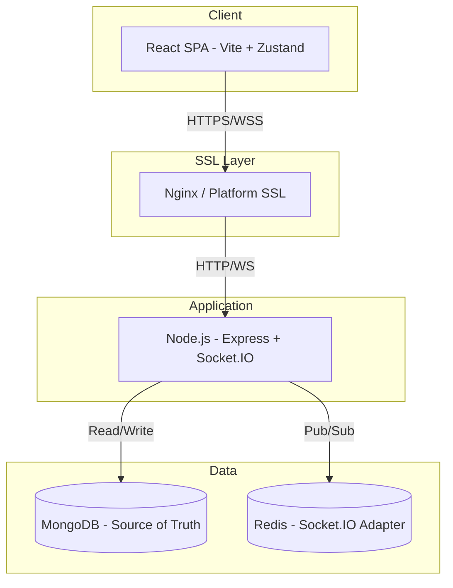
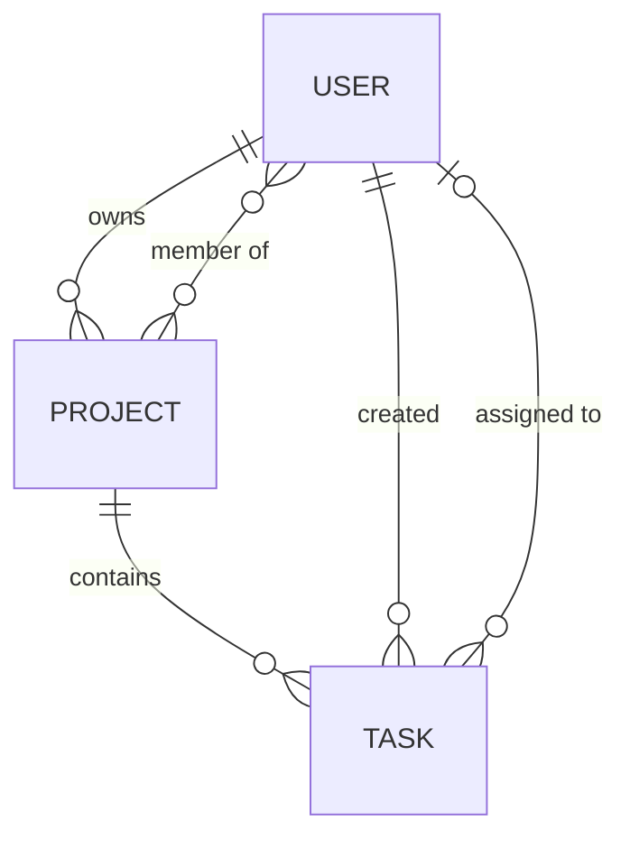

# Phase 1: Architecture & Planning Report

## Internal Project Management System (IPMS) — Real-Time Collaboration

**Version**: 1.1 (Post-Review)  
**Date**: August 2026

---

## 1. Assignment Understanding

### Source: Official Assessment PDF

This project is an **internal project management tool** for a growing company. The key challenge is supporting **real-time task updates** across multiple users working on the same project simultaneously.

### Requirement Traceability

| Assignment Requirement | Required by PDF? | Planned? | Location | Notes |
|---|---|---|---|---|
| Node.js + Express backend | Mandatory | Yes | §7 | — |
| MongoDB | Mandatory | Yes | §9 | — |
| JWT Authentication | Mandatory | Yes | §13 | — |
| WebSockets (Socket.IO) | Mandatory | Yes | §11 | — |
| Redis | Mandatory | Yes | §12 | Socket.IO adapter |
| React or Next.js frontend | Mandatory | Yes (React) | §8 | Justified |
| State management (justified) | Mandatory | Yes (Zustand) | §8 | Justified |
| FRD (1-2 pages) | Mandatory | Yes | docs/FRD.md | — |
| High-level architecture diagram | Mandatory | Yes | §6 | Mermaid |
| API list (endpoint + purpose) | Mandatory | Yes | §10 | — |
| Database schema | Mandatory | Yes | §9 | — |
| Real-time communication strategy | Mandatory | Yes | §11 | — |
| Scalability considerations | Mandatory | Yes | §15 | — |
| Auth (JWT) | Mandatory | Yes | §13 | — |
| CRUD: Projects & Tasks | Mandatory | Yes | §10 | — |
| Task status updates (real-time) | Mandatory | Yes | §11 | — |
| Socket authentication | Mandatory | Yes | §11 | — |
| Centralized error handling | Mandatory | Yes | §13 | — |
| Input validation | Mandatory | Yes | §13 | — |
| Clean service-layer architecture | Mandatory | Yes | §7 | — |
| Mandatory folder structure (src/) | Mandatory | Yes | §7 | Matches PDF |
| Login screen | Mandatory | Yes | §8 | — |
| Project list screen | Mandatory | Yes | §8 | — |
| Task board (real-time) | Mandatory | Yes | §8 | — |
| Reusable components | Mandatory | Yes | §8 | — |
| Controlled forms | Mandatory | Yes | §8 | — |
| Clean API + socket abstraction | Mandatory | Yes | §8 | — |
| Error & loading handling | Mandatory | Yes | §8 | — |
| Deployment (VM or free service) | Mandatory | Yes | §17 | Both documented |
| Nginx reverse proxy | Mandatory (VM) | Yes | §17 | VM path only |
| SSL enabled | Mandatory | Yes | §17 | — |
| GitHub Actions CI pipeline | Mandatory | Yes | §18 | — |
| Lint + build + deploy steps | Mandatory | Yes | §18 | — |
| Branching strategy explained | Mandatory | Yes | §18 | — |
| README documentation | Mandatory | Yes | §19 | — |
| AI Usage Declaration | Mandatory | Yes | §19 | — |
| Loom Video (8-10 min) | Mandatory | Planned | Post-impl | — |
| Rate limiting | Engineering decision | Yes | §13 | Good practice |
| Health check endpoint | Engineering decision | Yes | §10 | Good practice |

---

## 2. Repository Assessment

**Status**: Contains only `docs/` folder with planning artifacts. No application code, no Git init.

---

## 3. Final MVP Scope

### In Scope

1. **Authentication**: Register, Login, Logout (client-side) with JWT
2. **Projects**: CRUD + add/remove members (by email lookup)
3. **Tasks**: CRUD with statuses (Todo, In Progress, Done)
4. **Real-Time**: Task mutations broadcast instantly to online project members
5. **Authorization**: Project-level access (members only)
6. **Frontend**: Login, Project list, Task board pages
7. **Deployment**: Backend + Frontend with SSL, public URLs
8. **CI/CD**: GitHub Actions (lint + build)
9. **Documentation**: README + design docs

### NOT in MVP

- Email delivery/invitations, email verification, password reset
- Task comments, attachments, drag-and-drop
- Server-side token revocation, refresh tokens
- Search/filtering, activity logs, notifications

---

## 4. Functional Requirement Document

See standalone: **docs/FRD.md**

---

## 5. Roles & Permissions

### Definitions

| Role | Scope | Assignment |
|---|---|---|
| Admin | Per-project | Auto-assigned to project creator |
| Member | Per-project | Added by Admin (lookup by email) |

### Permission Matrix (within a specific project)

| Action | Admin | Member | Non-member |
|---|---|---|---|
| Create new project | Yes | Yes | Yes (any auth user) |
| View this project | Yes | Yes | No |
| Update project details | Yes | No | No |
| Delete project | Yes | No | No |
| Manage members | Yes | No | No |
| Create tasks | Yes | Yes | No |
| Update any task | Yes | Yes | No |
| Delete tasks | Any | Own only | No |
| Join socket room | Yes | Yes | No |

---

## 6. System Architecture

### High-Level Diagram



Express and Socket.IO share one Node.js process and one HTTP server.

### Core Principles

1. **Database = source of truth**: Mutations persist to MongoDB first. Sockets are notifications.
2. **Emit after persistence**: Never notify about uncommitted state.
3. **REST for mutations, WS for push**: Each protocol does what it's best at.
4. **Stateless auth**: JWT — any instance can verify any request.

---

## 7. Backend Architecture

### Folder Structure (matches PDF mandate)

```
server/
├── src/
│   ├── controllers/          # Extract params, call service, send response
│   │   ├── auth.controller.js
│   │   ├── project.controller.js
│   │   └── task.controller.js
│   ├── services/             # Business logic, DB ops, socket emission
│   │   ├── auth.service.js
│   │   ├── project.service.js
│   │   ├── task.service.js
│   │   └── socket.service.js
│   ├── routes/               # Endpoint definitions + middleware wiring
│   │   ├── index.js
│   │   ├── auth.routes.js
│   │   ├── project.routes.js
│   │   └── task.routes.js
│   ├── models/               # Mongoose schemas
│   │   ├── user.model.js
│   │   ├── project.model.js
│   │   └── task.model.js
│   ├── sockets/              # Socket.IO init, auth middleware, room logic
│   │   └── index.js
│   ├── middleware/           # Cross-cutting concerns
│   │   ├── auth.middleware.js
│   │   ├── validate.middleware.js
│   │   ├── authorize.middleware.js
│   │   └── error.middleware.js
│   ├── config/               # Env, DB, Redis connections
│   │   ├── db.js
│   │   ├── redis.js
│   │   └── env.js
│   ├── utils/
│   │   ├── ApiError.js
│   │   └── constants.js
│   └── app.js                # Express app config
├── server.js                 # Entry: HTTP server + Socket.IO attach + listen
├── package.json
├── .env.example
└── .eslintrc.js
```

### Layer Rules

| Layer | Does | Does NOT |
|---|---|---|
| Routes | Wire endpoints + middleware | Contain logic |
| Middleware | Auth, validate, authorize, errors | Know business rules |
| Controllers | Parse request, call service, format response | Touch DB or sockets |
| Services | Business logic, model calls, emit socket events | Know about req/res |
| Models | Schema, data access | Know about HTTP or sockets |
| Sockets | Connection auth, room management | Contain business logic |

---

## 8. Frontend Architecture

### React (Vite) — not Next.js

- Internal SPA with zero SEO needs
- No server rendering adds simplicity
- Static build deploys anywhere
- Simpler real-time state reasoning

### Zustand — not Redux, not Context

- Selective subscriptions → only affected TaskCard re-renders on socket event
- Works outside React → socket listeners update store without hooks
- Minimal boilerplate for 3 screens
- Context re-renders all consumers; Redux adds ceremony without proportional benefit

### Structure

```
client/src/
├── api/           # Axios instance + endpoint modules
├── socket/        # Connection management + event listeners
├── stores/        # authStore, projectStore, taskStore
├── pages/         # LoginPage, RegisterPage, ProjectsPage, TaskBoardPage
├── components/    # common/, layout/, projects/, tasks/
├── hooks/         # useSocket
├── utils/
├── App.jsx
└── main.jsx
```

### Real-Time UI Flow

```
Socket event 'task:updated' arrives
  → listeners.js calls taskStore.applyTaskUpdate(payload)
    → Zustand updates task in array immutably
      → Only subscribed TaskCard re-renders
```

---

## 9. Database Design

### Users Collection

```javascript
{
  _id: ObjectId,
  name: String,            // required, 2-50 chars
  email: String,           // required, unique, lowercase, trimmed
  password: String,        // bcrypt hash
  createdAt: Date,
  updatedAt: Date
}
// Index: { email: 1 } unique
```

### Projects Collection

```javascript
{
  _id: ObjectId,
  name: String,            // required, 2-100 chars
  description: String,     // optional, max 500 chars
  owner: ObjectId,         // ref: User (the Admin)
  members: [ObjectId],     // ref: User[] (includes owner)
  createdAt: Date,
  updatedAt: Date
}
// Index: { members: 1 }
```

**Design note**: `owner` is always in `members[]`. Authorization checks only need `members.includes(userId)`. The `owner` field is only checked for admin-level operations.

### Tasks Collection

```javascript
{
  _id: ObjectId,
  title: String,           // required, 2-200 chars
  description: String,     // optional, max 1000 chars
  status: String,          // enum: ['todo', 'in_progress', 'done'], default: 'todo'
  priority: String,        // enum: ['low', 'medium', 'high'], default: 'medium'
  project: ObjectId,       // ref: Project, required
  assignee: ObjectId,      // ref: User, optional
  createdBy: ObjectId,     // ref: User, required
  createdAt: Date,
  updatedAt: Date
}
// Index: { project: 1, status: 1 }
```

### ER Diagram



### Project Deletion Strategy

Sequential service call: delete all tasks with `project: projectId`, then delete project, then emit `project:deleted` to room and force-leave all sockets. No MongoDB transaction needed — orphaned tasks (if partial failure) reference a non-existent project and won't surface in any queries.

---

## 10. REST API Specification

### Auth

| Method | Endpoint | Purpose | Auth |
|---|---|---|---|
| POST | `/api/auth/register` | Create account | No |
| POST | `/api/auth/login` | Get JWT | No |
| POST | `/api/auth/logout` | Client-side cleanup | Yes |
| GET | `/api/auth/me` | Current user info | Yes |

### Projects

| Method | Endpoint | Purpose | Authorization |
|---|---|---|---|
| POST | `/api/projects` | Create project | Any auth user |
| GET | `/api/projects` | List my projects | Member projects only |
| GET | `/api/projects/:id` | Project details | Member |
| PUT | `/api/projects/:id` | Update project | Admin |
| DELETE | `/api/projects/:id` | Delete project + tasks | Admin |
| POST | `/api/projects/:id/members` | Add member by email | Admin |
| DELETE | `/api/projects/:id/members/:userId` | Remove member | Admin |

### Tasks

| Method | Endpoint | Purpose | Authorization |
|---|---|---|---|
| POST | `/api/projects/:projectId/tasks` | Create task | Member |
| GET | `/api/projects/:projectId/tasks` | List tasks | Member |
| PUT | `/api/projects/:projectId/tasks/:id` | Update task | Member |
| DELETE | `/api/projects/:projectId/tasks/:id` | Delete task | Admin or creator |

### Health

| Method | Endpoint | Purpose | Auth |
|---|---|---|---|
| GET | `/api/health` | Liveness check | No |

### Response Format

```javascript
// Success: { "success": true, "data": { ... } }
// Error:   { "success": false, "message": "...", "errors": [...] }
```

---

## 11. Socket.IO Specification

### Connection Lifecycle

1. User authenticates via REST → receives JWT
2. Client connects: `io(URL, { auth: { token } })`
3. Server middleware verifies JWT → accepts or rejects connection
4. Client emits `project:join` with `{ projectId }`
5. Server validates membership → joins socket to room `project:<projectId>`
6. Client receives real-time events for that project
7. On navigation away → client emits `project:leave`
8. On disconnect → Socket.IO auto-cleans room membership
9. On reconnect → re-authenticate, re-join room, fetch fresh data from REST

### Events

**Client → Server:**

| Event | Payload | Action |
|---|---|---|
| `project:join` | `{ projectId }` | Validate membership → join room |
| `project:leave` | `{ projectId }` | Leave room |

**Server → Client (emitted to room, excluding sender):**

| Event | Payload | Trigger |
|---|---|---|
| `task:created` | `{ task }` | Task created via API |
| `task:updated` | `{ task }` | Task updated via API |
| `task:deleted` | `{ taskId }` | Task deleted via API |
| `member:added` | `{ user: { _id, name, email } }` | Member added |
| `member:removed` | `{ userId }` | Member removed |
| `error` | `{ message }` | Auth/authorization failure |

### Room Strategy

- Pattern: `project:<projectId>`
- Server validates membership on every `project:join`
- Events emit to room excluding sender (`socket.to(room).emit(...)`)
- Member removal → force socket out of room + emit `member:removed`

### Reconnection

- Socket.IO built-in exponential backoff
- On reconnect: re-auth (token in handshake), re-join room, GET fresh task list from API
- Missed events during disconnect are NOT replayed — fresh API data is the reconciliation

---

## 12. Redis Strategy

### Single Responsibility: Socket.IO Pub/Sub Adapter

```javascript
const { createAdapter } = require('@socket.io/redis-adapter');
const pubClient = createClient({ url: REDIS_URL });
const subClient = pubClient.duplicate();
io.adapter(createAdapter(pubClient, subClient));
```

### Why Redis

| Question | Answer |
|---|---|
| Why needed? | Enables Socket.IO event propagation across multiple Node.js instances |
| What if single instance? | Adapter still works; events broadcast locally. Scaling requires zero code changes later. |
| Why not MongoDB change streams? | Higher latency, more complex, not designed for ephemeral pub/sub |
| Does Redis store data? | No persistent data. Pure message passing. Redis restart = no data loss. |

### Redis Unavailability

| Scenario | Impact |
|---|---|
| Redis down, single instance | Socket.IO works locally — no cross-instance needed |
| Redis down, multi-instance | Events don't propagate between instances |
| Redis restarts | Adapter auto-reconnects; client reconciles via REST |

### What Redis Does NOT Do (And Why)

- **NOT used for JWT blacklist**: Adds per-request latency, complicates middleware. Client-side logout suffices for internal tool.
- **NOT used for caching**: No demonstrated performance need.
- **NOT used for sessions**: JWT is stateless.

---

## 13. Authentication & Security

### JWT Strategy (Final)

| Aspect | Decision | Reasoning |
|---|---|---|
| Token type | Access token only | No refresh token — simpler, acceptable for internal tool |
| Lifetime | 7 days | Internal tool — users shouldn't re-login daily |
| Payload | `{ userId, email, iat, exp }` | Minimal claims |
| Algorithm | HS256 | Single service, no asymmetric need |
| Storage (client) | localStorage | See trade-off below |
| Transmission | `Authorization: Bearer <token>` | Standard, works with CORS |
| Server-side revocation | None | Client discards on logout |
| Socket auth | `socket.handshake.auth.token` | Same JWT |

### Why No Refresh Token

Refresh tokens add a second token, rotation logic, secure cookie storage, and silent-refresh client code. For an internal tool where users are trusted employees, this complexity doesn't address a real threat. The 7-day token means weekly re-login.

### Token Storage: localStorage — Honest Trade-Off

| Option | Pros | Cons |
|---|---|---|
| localStorage | Simple, JS-accessible (needed for Socket.IO auth), cross-tab | Vulnerable to XSS |
| httpOnly cookie | XSS-immune | Requires CSRF protection, complicates Socket.IO auth |

**We chose localStorage because**:
1. Socket.IO requires passing token in the `auth` handshake — needs JS access
2. No cookies = no CSRF concerns = simpler CORS
3. XSS is mitigated by: React JSX auto-escaping, input validation, no `dangerouslySetInnerHTML`, Content-Security-Policy headers, helmet

**This is NOT "internal = no security risk."** It's that the cookie alternative adds tangible complexity (CSRF, Socket.IO workaround) while XSS risk is already mitigated at the application layer.

### Password Security

- bcrypt, 10 salt rounds
- Minimum 6 characters
- Only hash stored

### Security Measures

| Measure | Threat Addressed |
|---|---|
| JWT verification on every protected route | Unauthorized access |
| Input validation (Joi) | Injection, malformed data |
| ObjectId format validation | NoSQL injection via malformed IDs |
| bcrypt password hashing | Credential theft |
| CORS explicit origin (not `*`) | Cross-origin attacks |
| Helmet headers | Clickjacking, MIME sniffing |
| Rate limiting (express-rate-limit) | Brute force, DoS |
| Error sanitization (no stack traces in prod) | Information disclosure |
| Body size limit | Payload DoS |
| Environment variables for secrets | Credential exposure |

### What Helmet Does NOT Do

Helmet sets browser-instruction headers. It does NOT prevent XSS by itself. XSS prevention comes from: React's escaping + validation + CSP + no dangerous patterns.

### Environment Variables

```env
NODE_ENV=development
PORT=5000
MONGODB_URI=mongodb://localhost:27017/ipms
JWT_SECRET=change-this-in-production
JWT_EXPIRES_IN=7d
REDIS_URL=redis://localhost:6379
FRONTEND_URL=http://localhost:5173
```

---

## 14. Consistency & Concurrency

### Scenario A: Simultaneous Task Update

Two users update the same task at ~same time → **last-write-wins**.

MongoDB's document-level locking ensures no corruption. The second write overwrites the first. Both emit socket events. All clients converge on final state.

**Why acceptable**: Small team, internal tool, low collision probability. The "wrong" status is immediately visible and correctable. Future: add `__v` version field + 409 Conflict on stale update.

### Scenario B: DB Succeeds, Socket Fails

DB state is correct. Other users miss real-time update but see it on next fetch/refresh. This is rare (in-process call) and self-correcting.

### Scenario C: Socket Event During API Load

Socket events apply to store immediately. API response replaces state on arrival. Brief inconsistency self-corrects.

### Scenario D: Disconnect + Reconnect

Auto-reconnect → re-join room → fresh GET from API. No event replay; API data is reconciliation.

### Scenario E: Unauthorized Project Access

API middleware → 403. Socket join → rejected + error event. UI → project list only shows member projects.

### Scenario F: Member Removed While Connected

Service removes from members → emits `member:removed` → forces socket out of room. Client navigates away. Future API calls → 403.

---

## 15. Scalability Considerations

### MVP: Single Instance

One Node.js process handles HTTP + WebSocket. Sufficient for the assessment scope.

### What Enables Future Scaling (Zero Code Changes)

| Choice | Benefit |
|---|---|
| Stateless JWT | Any instance verifies any request |
| Redis Socket.IO adapter | Events propagate between instances |
| No server-side session state | Nothing to synchronize |
| Static frontend | Deploy to CDN independently |

### Scaling Path

```
MVP:     1 Node.js → MongoDB Atlas → Redis
Growth:  N Node.js + Load Balancer → MongoDB Atlas → Redis
Scale:   N Node.js + LB → MongoDB Replica Set → Redis Cluster → CDN
```

### Potential Bottlenecks

| Bottleneck | Mitigation |
|---|---|
| Single-process CPU | Add instances behind load balancer |
| MongoDB connections | Pooling (Mongoose default) |
| Large rooms | Pagination, event batching |
| Task list growth | Compound index + API pagination |

**Note**: We do not claim specific user count capacities. The architecture supports horizontal scaling through the patterns above.

---

## 16. Testing Strategy

### Backend

| Category | Tool | Focus |
|---|---|---|
| Unit | Jest | Services, validators |
| Integration | Jest + Supertest | API endpoints + DB |
| Socket | Jest + socket.io-client | Connection, rooms, events |

### Frontend

| Category | Tool | Focus |
|---|---|---|
| Component | Vitest + RTL | Rendering, interactions |
| Store | Vitest | Zustand logic |

### Critical E2E Scenario

```
User A logs in → opens project → sees task board
User B logs in → opens same project
User A moves task Todo → In Progress
User B's board updates WITHOUT refresh
User C logs in later → sees task in "In Progress"
```

---

## 17. Deployment Architecture

### PDF Requirement

> "If you have a VM then deploy this way otherwise you can use free services like netlify, render etc"

### Primary: Render (Free Tier)

| Component | Platform | Notes |
|---|---|---|
| Frontend | Render Static Site | Serves `client/dist` |
| Backend | Render Web Service | Node.js, auto-SSL |
| MongoDB | MongoDB Atlas | Free M0 cluster |
| Redis | Redis Cloud / Upstash | Free tier |

Render provides SSL and routing natively. **No Nginx needed on Render** — the platform handles what Nginx does on a VM.

### Documented Alternative: VM + Nginx

```nginx
server {
    listen 443 ssl;
    server_name ipms.example.com;
    ssl_certificate /etc/letsencrypt/live/.../fullchain.pem;
    ssl_certificate_key /etc/letsencrypt/live/.../privkey.pem;

    location / {
        root /var/www/ipms/client/dist;
        try_files $uri /index.html;
    }
    location /api {
        proxy_pass http://localhost:5000;
        proxy_set_header Host $host;
        proxy_set_header X-Real-IP $remote_addr;
    }
    location /socket.io {
        proxy_pass http://localhost:5000;
        proxy_http_version 1.1;
        proxy_set_header Upgrade $http_upgrade;
        proxy_set_header Connection "upgrade";
    }
}
```

The VM path uses Nginx for SSL termination, static serving, and WebSocket proxying — fulfilling the PDF's Nginx requirement.

### Why Render Is Acceptable

The PDF explicitly permits free services ("netlify, render etc"). Render demonstrates that the application deploys and runs in production. The VM/Nginx configuration is documented separately to satisfy the infrastructure knowledge requirement.

---

## 18. Git & CI/CD Strategy

### Branch Strategy

```
main (production — auto-deploys)
  ├── feature/auth
  ├── feature/projects
  ├── feature/tasks-realtime
  ├── feature/frontend
  └── feature/deployment
```

Feature branches merge directly to `main`. No `develop` branch — for a solo assessment, it adds ceremony without value. The branching strategy demonstrates:
- Feature isolation (clean commits per concern)
- Merge to main = deploy (simple, traceable)
- Clean git history

### Commit Convention

```
feat: add JWT authentication middleware
fix: handle expired token in socket reconnect
docs: add API documentation
refactor: extract validation to middleware
chore: configure ESLint
```

### GitHub Actions

```yaml
name: CI
on:
  push:
    branches: [main]
  pull_request:
    branches: [main]

jobs:
  ci:
    runs-on: ubuntu-latest
    steps:
      - uses: actions/checkout@v4
      - uses: actions/setup-node@v4
        with: { node-version: 18 }
      - name: Backend lint
        run: cd server && npm ci && npm run lint
      - name: Frontend lint + build
        run: cd client && npm ci && npm run lint && npm run build
```

Deploy step triggers via Render auto-deploy on push to `main`, or via deploy hook.

---

## 19. Documentation Plan

### Final Structure

```
README.md                          # Required by PDF
docs/
├── FRD.md                         # Functional requirements
├── PHASE1_ARCHITECTURE_REPORT.md  # This document (comprehensive planning)
├── ARCHITECTURE_DECISIONS.md      # Decision log
├── API.md                         # REST API reference (post-implementation)
├── SOCKET_EVENTS.md               # Socket event reference (post-implementation)
└── DEPLOYMENT.md                  # Deployment guide (post-implementation)
```

### README Contents (PDF Requirements)

1. Architecture overview + diagram
2. Design decisions & trade-offs
3. API list (summary)
4. Socket events list (summary)
5. Local setup instructions
6. Deployment steps
7. Live URLs
8. AI Usage Declaration

---

## 20. Interview Preparation

### Key Decisions to Defend

| # | Decision | Reason | Trade-off |
|---|---|---|---|
| 1 | React over Next.js | No SSR/SEO need for internal SPA | Lose SSR if requirements change |
| 2 | Zustand over Redux | Selective re-renders critical for real-time; less boilerplate | Smaller ecosystem |
| 3 | REST + Socket.IO | REST for mutations (semantics), WS for push (speed) | Two patterns to maintain |
| 4 | DB = source of truth | Data safety even if sockets fail | Extra DB call on mutations |
| 5 | Emit after persistence | Never notify uncommitted state | Slight latency increase |
| 6 | Redis = Socket.IO adapter only | Single clear purpose; enables horizontal scaling | Extra infra component |
| 7 | JWT 7d, no refresh token | Simple, sufficient for internal tool | Longer exposure window |
| 8 | localStorage for token | Needed for Socket.IO auth; avoids CSRF complexity | XSS exposure (mitigated) |
| 9 | Admin + Member only | Minimum model that works | Less granular |
| 10 | Last-write-wins | Simple, low collision risk at this scale | Silent overwrites possible |
| 11 | Project-based socket rooms | Natural auth boundary per project | — |
| 12 | Full refresh on reconnect | Correct, simple | More bandwidth |

### Critical Interview Q&A

**Q: Why not WebSocket for everything?**  
REST gives status codes, error handling, standard tooling, request/response clarity. WS is fire-and-forget — we'd build our own ack/error protocol from scratch. Each does what it's best at.

**Q: What if Redis goes down?**  
Single instance: Socket.IO works locally. Multi-instance: events stop crossing instances. No data loss either way — MongoDB has everything. Clients reconcile via REST.

**Q: How would you scale to many users?**  
Add Node.js instances behind a load balancer. Redis adapter handles cross-instance events. JWT is stateless — any instance serves any user. Frontend on CDN. Zero code changes.

**Q: Why socket emission in services, not controllers?**  
Service knows "state changed." Controller knows "request came in." Emission belongs where the business decision happens — after confirmed persistence.

**Q: How is socket access controlled?**  
Three layers: 1) JWT verification on connection. 2) Membership check on room join. 3) Room-based emission (inherent isolation).

---

## 21. Phase 1 Checklist

| PDF Requirement | Designed? | Document |
|---|---|---|
| FRD | Yes | docs/FRD.md |
| Architecture diagram | Yes | §6 |
| API list | Yes | §10 |
| Database schema | Yes | §9 |
| Real-time strategy | Yes | §11 |
| Scalability | Yes | §15 |
| Approach justification | Yes | §6, §8, §12 |

### Phase 2 Implementation Order

1. Backend foundation (Express, config, error handling, middleware)
2. Authentication (register, login, JWT middleware)
3. Projects (CRUD + members)
4. Tasks (CRUD + status)
5. Socket.IO (connection, rooms, real-time events)
6. Frontend foundation (Vite, Zustand, routing, API layer)
7. Frontend auth (login/register pages)
8. Frontend projects (list page)
9. Frontend tasks (board + real-time)
10. Deployment (Render + CI pipeline)
11. Documentation (README + final docs)

---

**No application code has been written.** Phase 2 begins upon approval.
